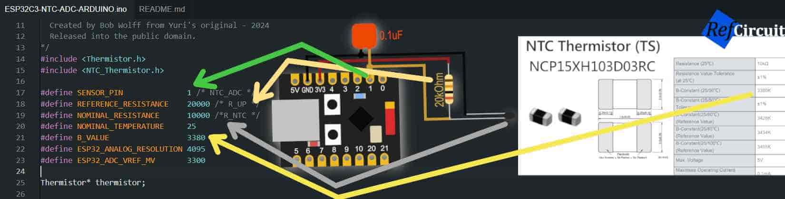
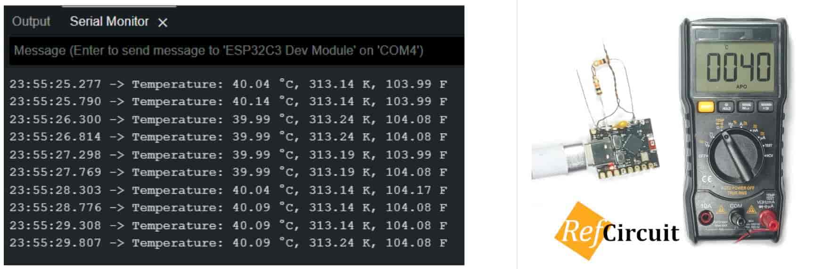

# ESP32C3-NTC-ADC-ARDUINO
* 📃 Full Article: https://refcircuit.com/articles/868-using-ntc-thermistor-for-temperature-measurement-with-simple-esp32-c3-arduino-library.html
___
* ESP32-C3 SoC
* Arduino IDE
* Arduino Framework
# Dependency Library

1) GitHub (original repo unavailable now): https://github.com/suoapvs/NTC_Thermistor
2) Mirror (directly from server): [refcircuit.com/upload/art/ntc%20esp32c3/f/NTC_Thermistor.zip](https://refcircuit.com/upload/art/ntc%20esp32c3/f/NTC_Thermistor.zip)

# Connection Diagram
Capacitor 0.1uF-1uF is strongly recommended between GND and ADC input.
  
# Using
1) Add NTC_Thermistor library
2) Change R_UP resistance, R_NTC and B_VALUE according to your NTC TS
  
# Arduino Configurations
  
# Test Results
Measurement results compare to the multimiter
  
